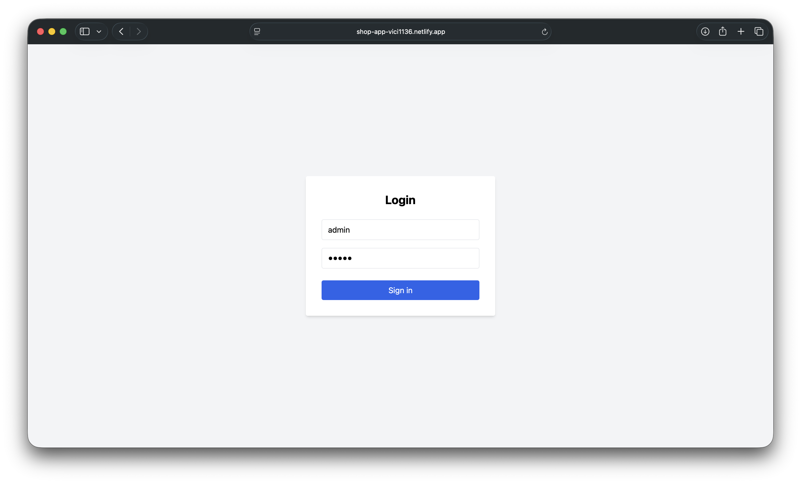
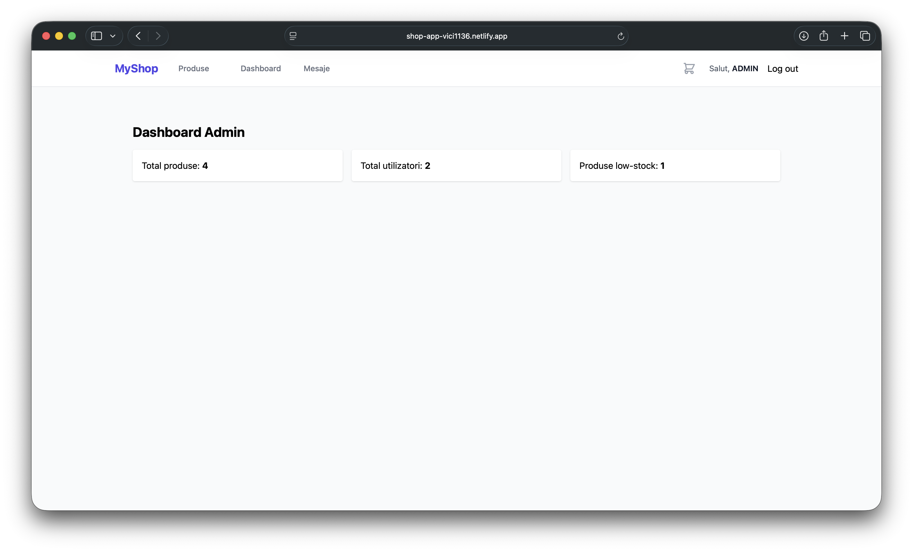
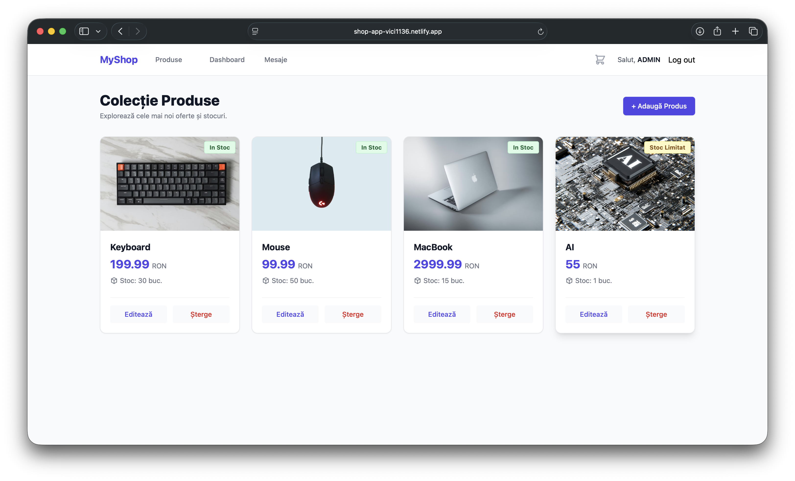
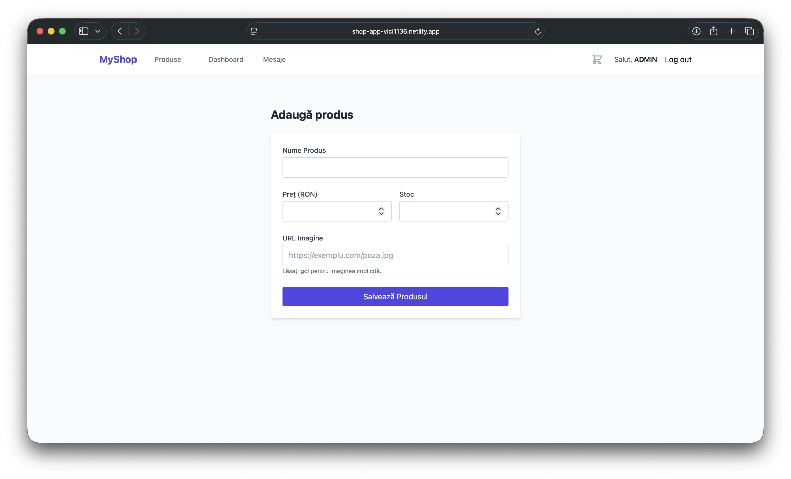
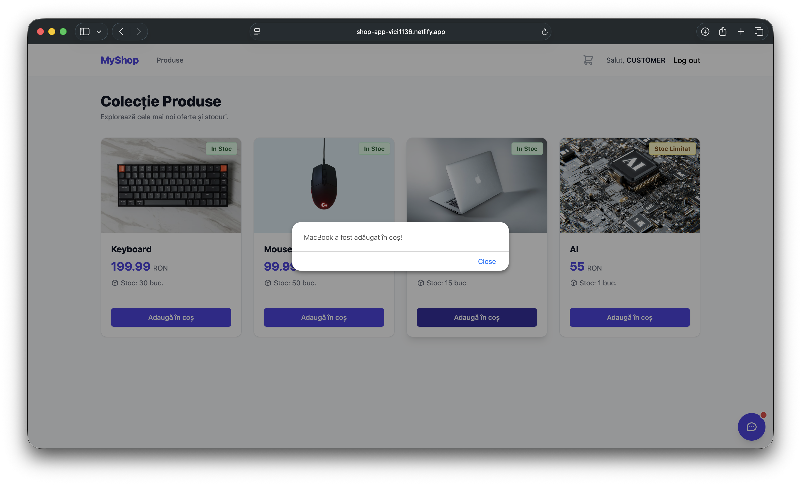
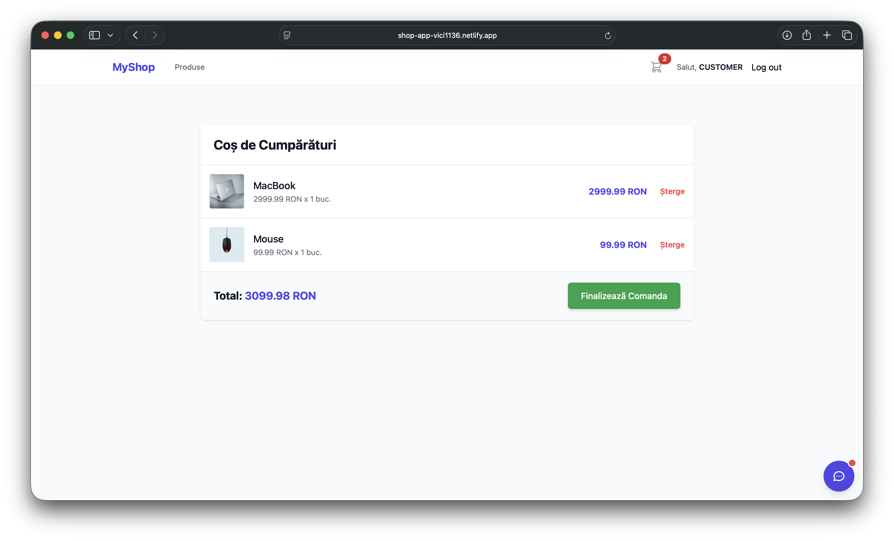
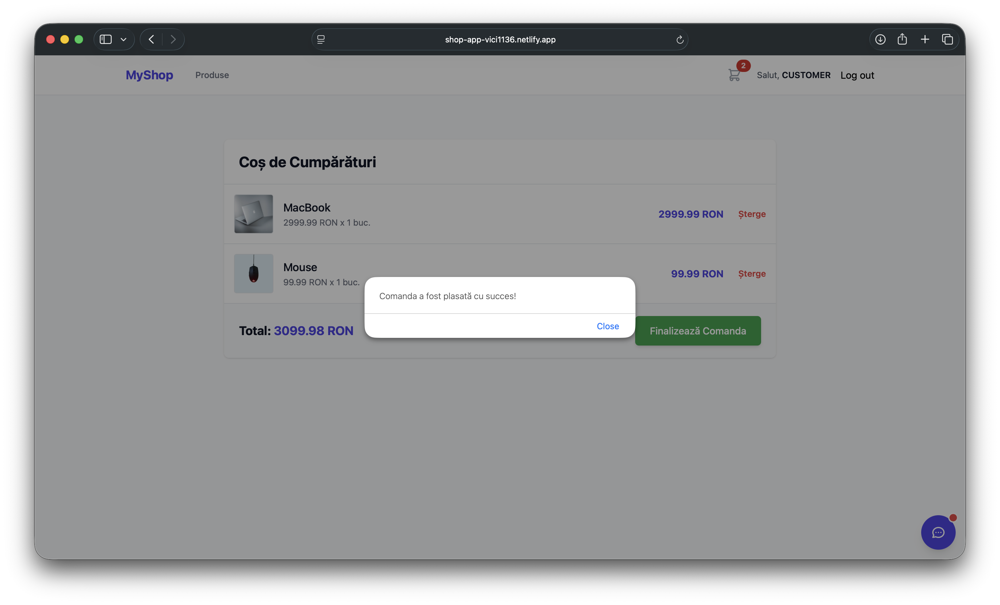
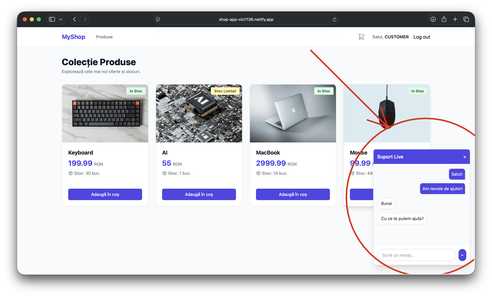
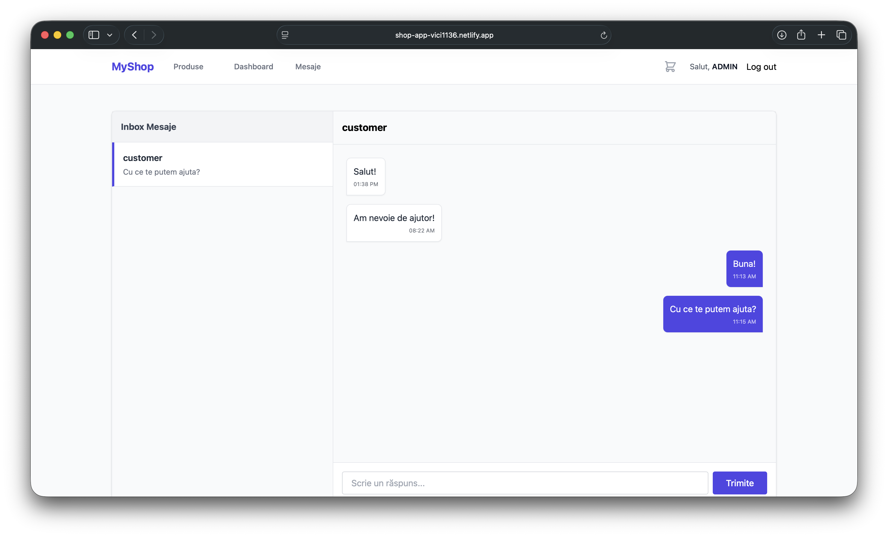

# 🛒 E-Commerce Full-Stack Platform

## 🌐 Live Links & API Documentation
* **Live Web Application:** [Shop App on Netlify](https://shop-app-vici1136.netlify.app/)
* **API Swagger Documentation:** [Shop Backend on Render](https://shop-backend-s5ax.onrender.com/swagger-ui/index.html#/)

### 🧪 Test/Demo Accounts
Don't want to register? Use these credentials to test the platform:
* **Admin User:** `admin` | **Password:** `admin`
* **Customer User:** `customer` | **Password:** `customer`

> ⚠️ **Important Note on Initial Load Time:** > Because the backend API is hosted on Render's free tier, the server spins down after 15 minutes of inactivity. **When you first visit the live application or try to log in, it may take 50-60 seconds to wake up.** Please be patient on the first request! Subsequent requests will be incredibly fast.

---

## 1. Project Summary
This project is a comprehensive, full-stack E-commerce web application designed to provide a seamless shopping experience and efficient store management. The core purpose of the application is to handle product catalogs, secure user authentication, and provide real-time customer support. 

It features a robust RESTful backend API isolated in Docker containers, a highly responsive React frontend, and a distributed cloud-based infrastructure.

## 2. Concepts & Architecture
The application is built using modern software engineering practices to ensure scalability, maintainability, and security:
* **Architecture:** Client-Server architecture utilizing a RESTful API.
* **Backend Design:** Layered Architecture (Controller, Service, Repository layers) adhering to **SOLID principles** and utilizing **Dependency Injection** via Spring IoC.
* **Security:** Stateless authentication mechanism using **JWT (JSON Web Tokens)** and Role-Based Access Control (RBAC).
* **Database Management:** Schema versioning and automated database migrations using **Flyway**.
* **Performance Optimization:** In-memory data structure store (**Redis**) caching to reduce database load.
* **Real-Time Communication:** Event-driven NoSQL database integration (**Firebase Firestore**) for real-time live chat functionality.
* **DevOps & CI/CD:** Containerization using **Docker** and multi-stage builds.

## 3. Technologies Used
### ⚙️ Backend
* **Java 21** & **Spring Boot 3** (Web, Data JPA, Security)
* **Gradle** (Build Automation Tool)
* **JWT** & **Bcrypt** for secure authentication
* **Swagger / OpenAPI** for API documentation

### 💻 Frontend
* **React.js** (Vite)
* **Axios** (HTTP client)
* **React Router**
* **Firebase** (Real-time Live Chat)

### ☁️ Infrastructure & Deployment
* **Docker & Docker Compose** (Containerization)
* **Render** (Backend API Hosting)
* **Netlify** (Frontend Hosting)
* **Neon** (Serverless Cloud PostgreSQL)
* **Upstash** (Serverless Cloud Redis)

---

## 4. Features & UI Showcase

The application offers tailored experiences based on user roles (Admin vs. Customer).

### 🔐 Secure Authentication
JWT-based login system that directs users to their specific interfaces based on their role.


### 🛠️ Admin Dashboard & Inventory Management
Administrators have full CRUD access to the product catalog and a dashboard summarizing business metrics.




### 🛍️ Customer Shopping Flow
Customers can browse the catalog, add items to their cart, and complete the checkout process seamlessly.




### 💬 Real-Time Live Support (Firebase)
A floating chat widget allows customers to communicate instantly with administrators. The admin has a dedicated Inbox to reply to users in real time.



---

## 5. Documentation & Learning Resources
Throughout the development of this project, several architectural guidelines and tutorials were followed:
* 📘 [REACT Documentation Site](https://alexandrugh.github.io/react-project-doc/)
* 📘 [Project Requirements & Next Steps](https://alexandrugh.github.io/AC_Inginerie_Software_2025-2026/)
* 📘 [Full Project and Interview Documentation](https://alexandrugh.github.io/Shop-Project-Documentation/)
* 🛠️ [CRUD API Design Guidelines](https://blog.stoplight.io/crud-api-design)
* 🎥 React Video Tutorials: [Part 1](https://www.youtube.com/watch?v=CgkZ7MvWUAA&t=15397s) | [Part 2](http://youtube.com/watch?v=G6D9cBaLViA&t=4513s)

## 6. How to Run Locally

If you want to run the project locally instead of using the live cloud version, you can do so using Docker or by installing the local software dependencies.

**Method A: Using Docker (Recommended)**

1. Clone the repository:
   ```bash
   git clone [https://github.com/vici1136/ecommerce-spring-react.git](https://github.com/vici1136/ecommerce-spring-react.git)
   cd ecommerce-spring-react
   ```

2. Start the Backend Infrastructure (API, Postgres, Redis):
   ```bash
   docker-compose up -d --build
   ```
   *The backend will be available at `http://localhost:8080`.*

3. Start the Frontend (requires Node.js):
   ```bash
   cd frontend
   npm install
   npm run dev
   ```
   *The frontend will be available at `http://localhost:5173`.*

**Method B: Manual Local Setup Requirements**

If you wish to run the services without Docker, you will need to install:
* [Node.js (npm)](https://nodejs.org/)
* [Redis Cache](https://github.com/tporadowski/redis/releases)
* [PostgreSQL](https://www.enterprisedb.com/downloads/postgres-postgresql-downloads)
* [Docker Desktop](https://www.docker.com/products/docker-desktop/) *(optional, but useful for hybrid environments)*

**Manual Setup Steps:**

1. Clone the repository and navigate to the project folder.
2. Ensure your local PostgreSQL and Redis servers are running on their default ports.
3. Create a database in PostgreSQL named `shop_db`.
4. Update the backend credentials (DB URL, Redis host, JWT secrets) in your configuration file or IDE environment variables.
5. Run the Spring Boot backend using IntelliJ IDEA or the Gradle wrapper:
   ```bash
   cd backend
   ./gradlew bootRun
   ```
6. Start the React frontend:
   ```bash
   cd frontend
   npm install
   npm run dev
   ```
